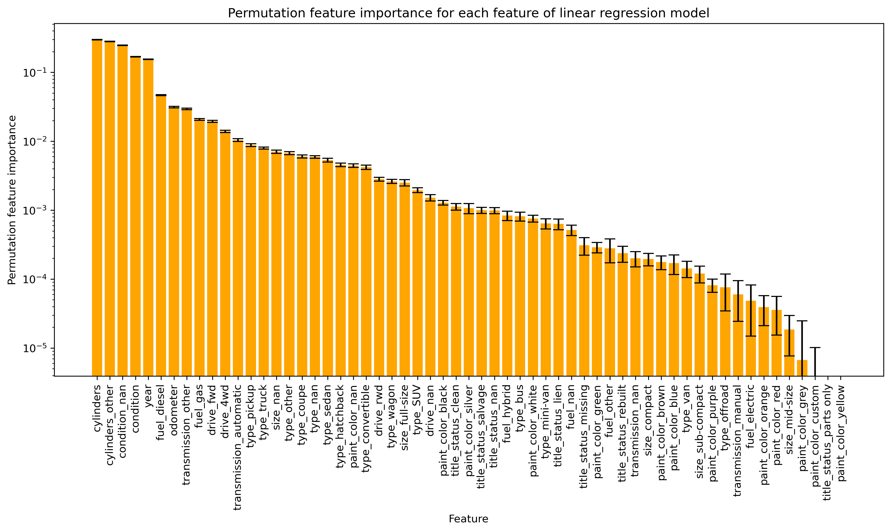
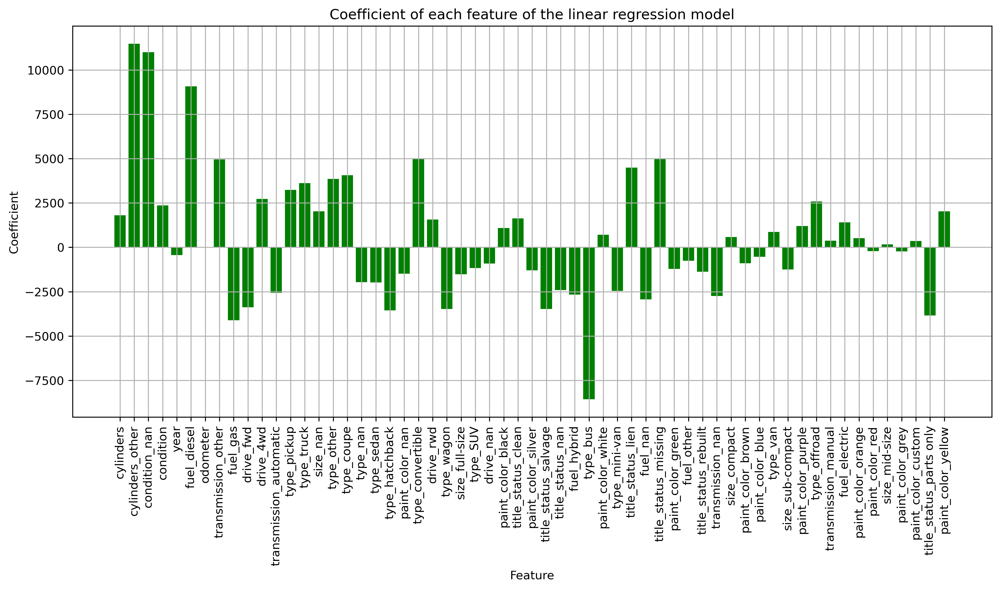

# What drives the price of a car?

### Link to analysis:
https://github.com/AdrianGrzybowski/Car_ML_exercise/blob/main/Analysis.ipynb
### Business Objectives:
The objective of this exercise is to create predictive model of of used car prices that can be used to readily asses fair value for used cars. 

### Model rationale:
To explain the observations, I have chosen a non-polynomial linear regression model based on 'size', 'paint_color', 'drive', 'fuel', 'transmission', 'type', 'title_status', 'odometer', 'condition', and 'year'. This model explains approximately 40% of the variability in car prices, and while the coefficients are imperfect, they can be used to approximate the value in USD for each change in a parameter. The observations are listed in a table called Importance1, sorted in decreasing importance to the model. I will also comment on the most important features that can be used to build a model with almost as good predictive power, based on observations from Sequential Feature Selection experiments.
### Observations:
1. Condition of the car is high a importance parameter with labels scores: 'new':6, 'like new':5, 'excellent':4, 'good':3, 'fair':2, 'salvage':1. It can be approximated that for each step up in car condition on average car can sell for extra +2400/level. When car condition is unknown on average it can be assumed to be equivalent to good/excellent condition.
2. Number of cylinders tracks well with a car price with every extra cylinder corresponding to +1800/cylinder, that being said, this parameter can be replaced by car's type as it tracks well with increasing size of the car, as such trucks and vans, or large size can be used instead and still produce good model.
3. Age of car is another important parameter on avearge each extra year corresponds to 430/year discount
4. Odometer reading can be used to predict a price with every 10,000 miles on odometer translating into -100 discount (-0.01/mile).
5. Among car types convertibles(+5000), coupes(+4100), trucks(+3600), pickups(+3200) and offroads(+2600) sell for higher price than other categories like bus(-8600), hatchback(-3600), wagon(-3500) .  
6. Fuel category is interesting although replacable by size or type category, diesel cars tend to be in cateogry trucks which tend to have higer price as such average price difference between gas(-4100) and diesel(+9100) cars is ~13200
7. Among type of drives, 4wd(+2700) is the most expensive followed by RWD(+1600) and FWD(-3400)
8. Transmission label "other"(+5000) tracks with higher value likely due to correlation with being used in utility vehicles. 
9. Title status influences the price lien(+4500), clean(+1600), rebuilt(-1400), parts_only(-3800), salvage(-3500). Interestingly missing(+5000) and NA(-2400) are distinguishable although they do not build good models. It is unclear why missing title sells at premium. 
10. Size is not very good parameter as it refers only to passanger cars pushing all other cars into NaN category: compact(+600), mid-size(+200), full-size(-1500), compact(-1200), NaN(+2000).
11. While paint color is not particularly important feature, among colors yellow(+2000), purple(+1200) and black(+1100) sells for the highest price and silver(-1300), green(-1200) and brown(-900) sell for the lowest 

### Future Directions:
    1. Build a model taking into consideration the 'manufacturer', 'model', 'state', or 'region' parameters that were excluded from this analysis.
    2. Split the dataset between trucks and passenger cars, as it would create two more interpretable models that are currently intertwined in the existing model.
	

